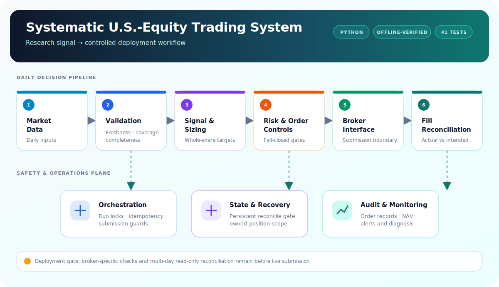

# Systematic U.S.-Equity Trading System

> A sanitized engineering overview of a production-oriented daily U.S.-equity trading system
> built in Python. The system is offline-verified and being prepared for July 2026 live
> deployment; no real orders have been submitted.

## Overview

The system turns a daily research signal into a whole-share target portfolio and a controlled
order workflow. This repository documents the operational engineering required to move from a
backtest toward live deployment while deliberately omitting the trading edge.

## Conceptual architecture

The diagram shows logical responsibilities, not a production topology, broker, schedule, or
implementation stack.

## Engineering highlights

- **Idempotent orchestration** — run locking and submission guards prevent overlapping or
  repeated jobs from creating duplicate orders.
- **Persistent reconciliation gate** — an interrupted or ambiguous run blocks subsequent
  submission until positions and fills are reconciled.
- **Data-integrity checks** — freshness, coverage, and completeness are validated before an order
  plan can proceed.
- **Scoped ownership** — the engine manages only positions attributable to this strategy and does
  not silently adopt unrelated holdings.
- **Risk and failure controls** — leverage, drawdown, sizing, and order-state invariants fail closed
  under invalid or incomplete state.
- **Operational observability** — structured state, order records, NAV snapshots, and alerts make
  runs diagnosable and auditable.

## Verification status

The engine has completed **five adversarial review passes and 41 offline safety tests** covering
duplicate submissions, partial fills, interrupted runs, stale or incomplete data, account
isolation, leverage limits, drawdown handling, and recovery paths.

Live submission remains disabled pending broker-specific integration checks and multi-day
read-only reconciliation against the deployment account. The distinction between offline
verification and live performance is intentional.

## Scope and confidentiality

This showcase excludes:

- Signal logic, model parameters, lookbacks, and security-selection rules
- Instrument universe, positions, account details, and broker identity
- Backtest and live-performance figures
- Production topology, schedules, credentials, configuration, and source code

It documents transferable research-to-production engineering experience only.
